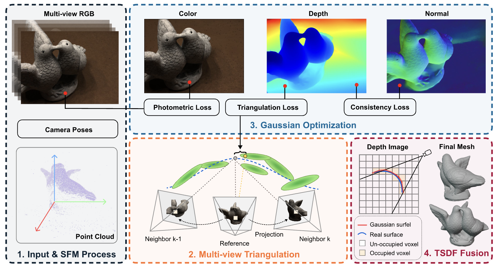
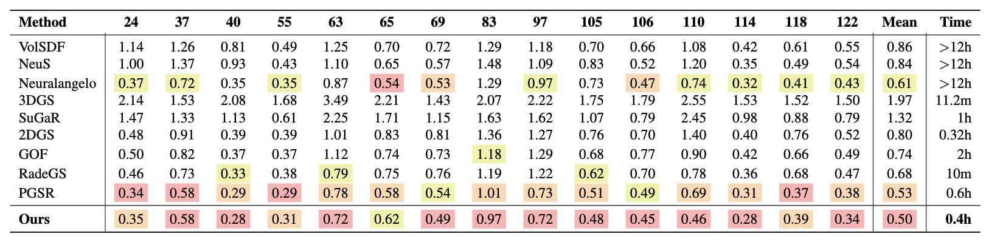
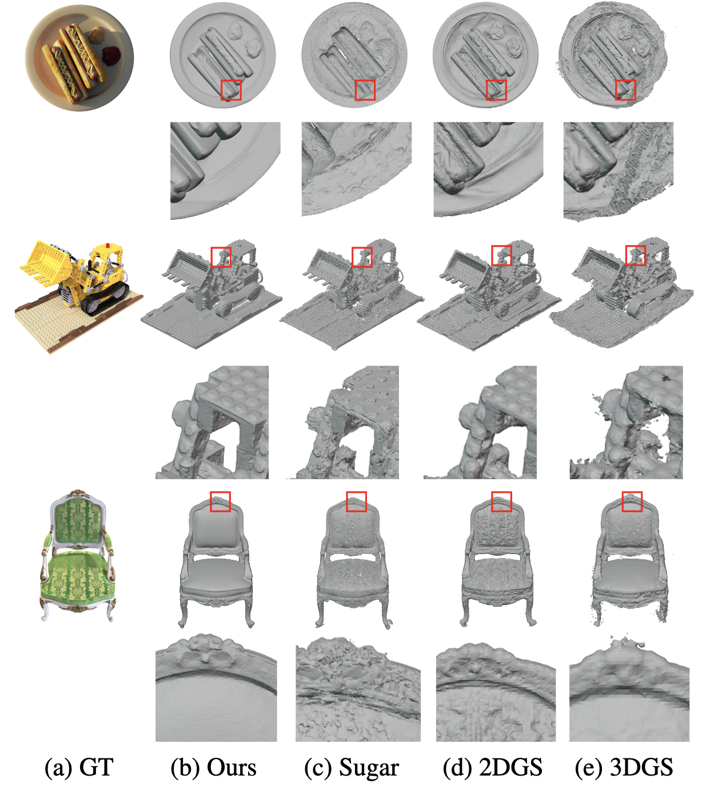

# TriaGS: Differentiable Triangulation-Guided Geometric Consistency for 3D Gaussian Splatting

Accepted at WACV 2026 : [The IEEE/CVF Winter Conference on Applications of Computer Vision 2026](https://wacv.thecvf.com/)

## Authors:
- [Quan Tran]()
- [Tuan Dang](www.tuandang.info)
> All authors are with [Cognitive Robotics Laboratory](https://www.cogniboticslab.org/)   
> Department of Electrical Engineering and Computer Science 
> University of Arkansas, Fayetteville, AR 72701, USA.

## Astract
3D Gaussian Splatting is crucial for real-time novel view synthesis due to its efficiency and ability to render photorealistic images. However, building a 3D Gaussian is guided solely by photometric loss, which can result in inconsistencies in reconstruction. This under-constrained process often results in "floater" artifacts and an unstructured geometry, preventing the extraction of high-fidelity surfaces. To address this issue, our paper introduces a novel method that improves reconstruction by enforcing global geometry consistency through constrained multi-view triangulation. Our approach aims to achieve a consensus on 3D representation in the physical world by utilizing various estimated views. We optimize this process by evaluating a 3D point against a robust consensus point, which is re-triangulated from a bundle of neighboring views in a self-supervised fashion. We demonstrate the effectiveness of our method across multiple datasets, achieving state-of-the-art results. On the DTU dataset, our method attains a mean Chamfer Distance of $0.50$ mm, outperforming comparable explicit methods. We will make our code open-source to facilitate community validation and ensure reproducibility.

# Overview
<p align="center">
    <br/>
</p>


## Environment and dependencies setup
``` shell

```


# Results

See more results in the paper and supplemental documents.

## Quatitative Results
<p align="center">
    <br/>
</p>

## Qualitative Results
<p align="center">
    <br/>
</p>

## Citing
```
@inproceedings{tran2025triags,
  title        = {TriaGS: Differentiable Triangulation-Guided Geometric Consistency for 3D Gaussian Splatting},
  author       = {Tran, Quan and Dang, Tuan},
  booktitle    = {The IEEE/CVF Winter Conference on Applications of Computer Vision 2026 (WACV)},
  year         = {2026},
  month        = March,
  note         = {},
  url          = {},
}
```
